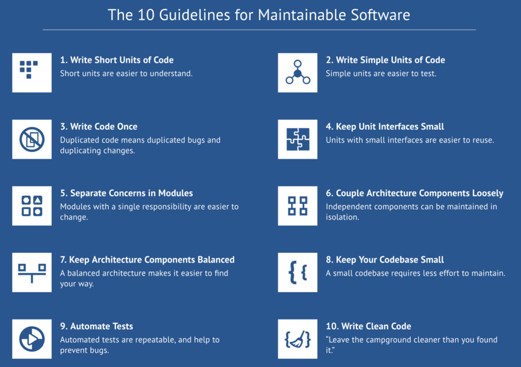

## Code quality matters

### A software engineering tale as old as time
So, let’s say you’re part of the group of IT Vitae students. Awesome! But let’s pause for a moment and think about tomorrow.

Tomorrow is the day you have to build further with today’s code. You know how it goes. Last night’s mistakes get thrown right in your face. You might utter words like: "Who wrote this code, I can’t work like this?!, only to realize that it was actually YOU. You hack some more until it sort of works… you think… hope… pray… maybe... for now...

Fast forward a few months. You present your end product, get some backing and build your application into a real-life working application, happily hacking along… and then something breaks. You know what it is, you think. You quickly push a fix to production, and all is well. But 10 minutes later, you get the next call, and before you know it, you’re knee-deep in spaghetti code, trying to decipher last month’s code hieroglyphs. It all comes tumbling down…

### The Better Code Hub team is here to help
Of course, this doom scenario is mostly an exaggeration, but more often than you might think, it’s the bitter reality. That’s why we at [Software Improvement Group](https://softwareimprovementgroup.com) preach good software quality, religiously. We believe that a little bit of effort now will save a lot of headaches down the road. And we’re helping out IT Vitae:

__: Getting the basics right__: [Better Code Hub](https://bettercodehub.com) provides a set of 10 basic rules to keep your code maintainable. Can you get a 10/10 score? [Last year at a Hackathon, 19 teams did it](https://hackernoon.com/writing-quality-code-under-time-pressure-62ebeb5f39c5) (that’s 30%). So you can, too. Following these guidelines will go a long way in keeping your code easy to maintain in the long run as well.

It’s good to know we didn’t just make this up. All the data and thresholds in our measurements compare your code against thousands of other systems we’ve seen over the past 19 years. If you pass a guideline, it means you’re doing better than the average developer out there. It’s science!

You can find the IT Vitae scoreboard [here](https://itvitae-software-developer.github.io/scoreboard)
